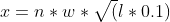

# A Dealer For the People

This is a secret project from KGB to analyze reviews from McKaig Chevrolet Buick - A Dealer For The People


Requirements
------------

- Elixir 1.11.1

Install
------------

To install all dependencies necessary to run the project, execute:

```shell script
mix deps.get
```


Running the Scraper
------------

```shell script
mix analyzes
```


Running Tests
------------

```shell script
mix test
```

or to get coverage:
```shell script
mix coveralls.html
```

To open coverage just type ` open cover/excoveralls.html` 


Overly Positive criteria
------------
To identify the most overly positive reviews, a score it's calculated based on how long is the review along with how many "overly positive" words it has.
Each word has a weight that influences the score.

Equation:



```text
x = score
n = number of occurrences of the word in text
w = weight
l = text length
```